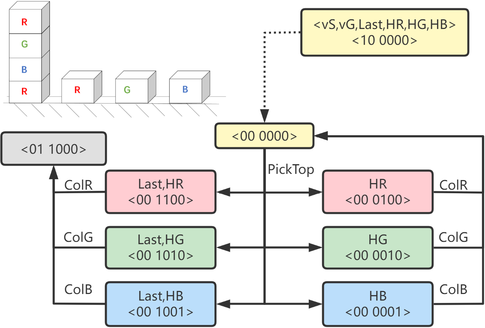

[TOC]
# $FOND^+$ is QNP + FOND
normal Strong-cyclic solution satisfies fairness assumption.

```
// PRP extends the oneof expression non-deterministic in the classical pddl's effect
:effect (oneof 
        (and (not(vStart)) (not(vGoal)) (not(BlocksCleared)) (H) )
        (and (not(vStart)) (vGoal) (BlocksCleared) (H) ))
```


QNP problems also require conditional fairness assumptions,FOND+is PRP extend with :fairness  keyword as follows:
> (:fairness
>​    :a (pick-above-x))
> (:fairness
> ​    :a (pick-above-y)
> ​    :b (put-x-on-y))
> 

Describes the constraints of the effect of increasing or decreasing each set of QNP actions, and the corresponding non-deterministic effect is actually PRP.

Fond to FONT+ is the same overall, but it requires artificially specified conditional fairness constraints for increases and decreases.


## demo Blocks_clear 

- domain file:

```lisp

(define (domain blocks_clear_d)
    (:requirements :typing :non_deterministic)
    (:types	)
    (:predicates
        (vStart)
        (vGoal)
    (BlocksCleared)
    (H)
    )
    
    (:action 8_virtual_source_act_0
    :parameters ()
        :precondition (and  (vStart)  )
        :effect (and (not(vStart)) (not(vGoal)) (not(BlocksCleared)) (not(H)) )
    )
    (:action 0_unstack_1_7
            :parameters ()
        :precondition (and (not(vStart)) (not(vGoal)) (not(BlocksCleared)) (not(H)) )
        :effect (oneof 
        (and (not(vStart)) (not(vGoal)) (not(BlocksCleared)) (H) )
        (and (not(vStart)) (vGoal) (BlocksCleared) (H) )
        )
    )
    (:action 1_putdown_0
            :parameters ()
        :precondition (and (not(vStart)) (not(vGoal)) (not(BlocksCleared)) (H) )
        :effect (and (not(vStart)) (not(vGoal)) (not(BlocksCleared)) (not(H)) )
    )
    (:action 1_stack_0
            :parameters ()
        :precondition (and (not(vStart)) (not(vGoal)) (not(BlocksCleared)) (H) )
        :effect (and (not(vStart)) (not(vGoal)) (not(BlocksCleared)) (not(H)) )
    )
)
```
- problem file
The emphasis is on: fairness achieves the input of conditional fairness:
```lisp
(define (problem blocks_clear_p)  
(:domain blocks_clear_d)  
(:objects )  
    (:init	(vStart)	)  
    (:goal	( and 	(vGoal)	)  )
    (:fairness
        :a (0_unstack_1_7);;  n$\uparrow$ 
        :b (1_stack_0) ;;n$\downarrow$
     );; For each set of addition and subtraction actions, a corresponding conditional fairness assumption is added
)
```


--------------------------------------------------------
Conclusion: In the input of the original generation system, it is necessary to specify the a/b action pair of the fairness of each set of conditions.


```lisp
(:fairness
        :a (0_unstack_1_7) 
        :b (1_stack_0)
     )
```

The generation system needs to derive the corresponding fairness assumptions of the $A(a)/B(b)$ abstract FOND action pairs of arbitrary pairs.

```lisp
(:fairness
        :a (0_unstack_1_7) 
        :b (1_stack_0)
     )
```

Results:

```bash
$ python -m fcfond.main -m fcfond.main -stats -out output.cur -planner fcfond/planner_clingo/fondplus_show_pretty.lp -pddl domains/pddl/tridu33/fond_blocks_clear_d.pddl domains/pddl/tridu33/fond_blocks_clear_p.pddl 

Namespace(atoms=False, clingo=None, experiments=[], expgoal=False, k=None, list=None, log=False, memout=8000000000.0, n=1, notrack=False, out='output.cur', pddl=['domains/pddl/tridu33/fond_blocks_clear_d.pddl', 'domains/pddl/tridu33/fond_blocks_clear_p.pddl'], planner='fcfond/planner_clingo/fondplus_show_pretty.lp', stats=True, t=1, timeout=1800.0)
Pddl processed. Start ASP solver.
Command ['clingo', 'fcfond/planner_clingo/fondplus_show_pretty.lp', 'output.cur/proc_fond_blocks_clear_p.lp', '-n', '1', '-t', '1', '--single-shot']
ASP Solved. Processing output
Output processed.
Problem: fond_blocks_clear_p
States: 4
Actions: 4
Pre-processing time: 0.234
Sat: True
Models: 1+
Calls: 1
Time: 0.087
Solve Time: 0.0
1st Model Time: 0.0
Unsat Time: 0.0
CPU Time: 0.067
Result: True
Max Memory: 58.712

               Problem  States  Actions  Pre-processing time   Sat Models  Calls   Time  Solve Time  1st Model Time  Unsat Time  CPU Time Result  Max Memory
0  fond_blocks_clear_p       4        4                0.234  True     1+      1  0.087         0.0             0.0         0.0     0.067   True      58.712
```


<div STYLE="page-break-after: always;"></div>

# RGB-Blocks(running example)

Example of the original version of rgbBlocks has $B_i = \emptyset$ ,here add $\langle A_i/B_i\rangle = \langle \{stack\}/ \{unstack\} \rangle$：

Start with 1 makeover to generate the FONT+ problem as follows:

- domain file:

```lisp

(define (domain RGBBlocks2_d)
    (:requirements :typing :non-deterministic)
    (:types	)
    (:predicates
        (vStart)
        (vGoal)
    (BlocksCleared)
    (HRed)
    (HGreen)
    (HBlue)
    )
    
    (:action 32_virtual_source_act_0
    :parameters ()
        :precondition (and  (vStart)  )
        :effect (and (not(vStart)) (not(vGoal)) (not(BlocksCleared)) (not(HRed)) (not(HGreen)) (not(HBlue)) )
    )
    (:action 0_pickTop_12_10_9_4_2_1
            :parameters ()
        :precondition (and (not(vStart)) (not(vGoal)) (not(BlocksCleared)) (not(HRed)) (not(HGreen)) (not(HBlue)) )
        :effect (oneof 
        (and (not(vStart)) (not(vGoal)) (BlocksCleared) (HRed) (not(HGreen)) (not(HBlue)) )
        (and (not(vStart)) (not(vGoal)) (BlocksCleared) (not(HRed)) (HGreen) (not(HBlue)) )
        (and (not(vStart)) (not(vGoal)) (BlocksCleared) (not(HRed)) (not(HGreen)) (HBlue) )
        (and (not(vStart)) (not(vGoal)) (not(BlocksCleared)) (HRed) (not(HGreen)) (not(HBlue)) )
        (and (not(vStart)) (not(vGoal)) (not(BlocksCleared)) (not(HRed)) (HGreen) (not(HBlue)) )
        (and (not(vStart)) (not(vGoal)) (not(BlocksCleared)) (not(HRed)) (not(HGreen)) (HBlue) )
        )
    )
    (:action 12_putTop_0
            :parameters ()
        :precondition (and (not(vStart)) (not(vGoal)) (BlocksCleared) (HRed) (not(HGreen)) (not(HBlue)) )
        :effect (and (not(vStart)) (not(vGoal)) (not(BlocksCleared)) (not(HRed)) (not(HGreen)) (not(HBlue)) )
    )
    (:action 12_colR_24
            :parameters ()
        :precondition (and (not(vStart)) (not(vGoal)) (BlocksCleared) (HRed) (not(HGreen)) (not(HBlue)) )
        :effect (and (not(vStart)) (vGoal) (BlocksCleared) (not(HRed)) (not(HGreen)) (not(HBlue)) )
    )
    (:action 10_putTop_0
            :parameters ()
        :precondition (and (not(vStart)) (not(vGoal)) (BlocksCleared) (not(HRed)) (HGreen) (not(HBlue)) )
        :effect (and (not(vStart)) (not(vGoal)) (not(BlocksCleared)) (not(HRed)) (not(HGreen)) (not(HBlue)) )
    )
    (:action 10_colG_24
            :parameters ()
        :precondition (and (not(vStart)) (not(vGoal)) (BlocksCleared) (not(HRed)) (HGreen) (not(HBlue)) )
        :effect (and (not(vStart)) (vGoal) (BlocksCleared) (not(HRed)) (not(HGreen)) (not(HBlue)) )
    )
    (:action 9_putTop_0
            :parameters ()
        :precondition (and (not(vStart)) (not(vGoal)) (BlocksCleared) (not(HRed)) (not(HGreen)) (HBlue) )
        :effect (and (not(vStart)) (not(vGoal)) (not(BlocksCleared)) (not(HRed)) (not(HGreen)) (not(HBlue)) )
    )
    (:action 9_colB_24
            :parameters ()
        :precondition (and (not(vStart)) (not(vGoal)) (BlocksCleared) (not(HRed)) (not(HGreen)) (HBlue) )
        :effect (and (not(vStart)) (vGoal) (BlocksCleared) (not(HRed)) (not(HGreen)) (not(HBlue)) )
    )
    (:action 4_putTop_0
            :parameters ()
        :precondition (and (not(vStart)) (not(vGoal)) (not(BlocksCleared)) (HRed) (not(HGreen)) (not(HBlue)) )
        :effect (and (not(vStart)) (not(vGoal)) (not(BlocksCleared)) (not(HRed)) (not(HGreen)) (not(HBlue)) )
    )
    (:action 4_colR_0
            :parameters ()
        :precondition (and (not(vStart)) (not(vGoal)) (not(BlocksCleared)) (HRed) (not(HGreen)) (not(HBlue)) )
        :effect (and (not(vStart)) (not(vGoal)) (not(BlocksCleared)) (not(HRed)) (not(HGreen)) (not(HBlue)) )
    )
    (:action 2_putTop_0
            :parameters ()
        :precondition (and (not(vStart)) (not(vGoal)) (not(BlocksCleared)) (not(HRed)) (HGreen) (not(HBlue)) )
        :effect (and (not(vStart)) (not(vGoal)) (not(BlocksCleared)) (not(HRed)) (not(HGreen)) (not(HBlue)) )
    )
    (:action 2_colG_0
            :parameters ()
        :precondition (and (not(vStart)) (not(vGoal)) (not(BlocksCleared)) (not(HRed)) (HGreen) (not(HBlue)) )
        :effect (and (not(vStart)) (not(vGoal)) (not(BlocksCleared)) (not(HRed)) (not(HGreen)) (not(HBlue)) )
    )
    (:action 1_putTop_0
            :parameters ()
        :precondition (and (not(vStart)) (not(vGoal)) (not(BlocksCleared)) (not(HRed)) (not(HGreen)) (HBlue) )
        :effect (and (not(vStart)) (not(vGoal)) (not(BlocksCleared)) (not(HRed)) (not(HGreen)) (not(HBlue)) )
    )
    (:action 1_colB_0
            :parameters ()
        :precondition (and (not(vStart)) (not(vGoal)) (not(BlocksCleared)) (not(HRed)) (not(HGreen)) (HBlue) )
        :effect (and (not(vStart)) (not(vGoal)) (not(BlocksCleared)) (not(HRed)) (not(HGreen)) (not(HBlue)) )
    )
)
```

problem

```lisp

(define (problem RGBBlocks2_p)  
(:domain RGBBlocks2_d)  
(:objects )  
    (:init	(vStart)	)  
    (:goal	( and 	(vGoal)	)  )
    (:fairness
        :a (0_pickTop_12_10_9_4_2_1)
        :b (12_putTop_0)(10_putTop_0)(9_putTop_0)(4_putTop_0)(2_putTop_0)(1_putTop_0))
)
```

Output of fond+ solver PEND-ASP:

```bash
$ cd /mnt/d/tridu33/ASP-AnswerSetProgramming/FOND-ASP 
$ python -m fcfond.main -stats -out output.RGBBlocks2 -planner fcfond/planner_clingo/fondplus_show_pretty.lp -pddl domains/pddl/autogenerated/fond_RGBBlocks2_d.pddl domains/pddl/autogenerated/fond_RGBBlocks2_p.pddl 

Namespace(atoms=False, clingo=None, experiments=[], expgoal=False, k=None, list=None, log=False, memout=8000000000.0, n=1, notrack=False, out='output.RGBBlocks2', pddl=['domains/pddl/autogenerated/fond_RGBBlocks2_d.pddl', 'domains/pddl/autogenerated/fond_RGBBlocks2_p.pddl'], planner='fcfond/planner_clingo/fondplus_show_pretty.lp', stats=True, t=1, timeout=1800.0)
Pddl processed. Start ASP solver.
Command ['clingo', 'fcfond/planner_clingo/fondplus_show_pretty.lp', 'output.RGBBlocks2/proc_fond_RGBBlocks2_p.lp', '-n', '1', '-t', '1', '--single-shot']
ASP Solved. Processing output
Output processed.
Problem: fond_RGBBlocks2_p
States: 9
Actions: 14
Pre-processing time: 0.141
Sat: True
Models: 1+
Calls: 1
Time: 0.051
Solve Time: 0.0
1st Model Time: 0.0
Unsat Time: 0.0
CPU Time: 0.039
Result: True
Max Memory: 58.836

             Problem  States  Actions  Pre-processing time   Sat Models  Calls   Time  Solve Time  1st Model Time  Unsat Time  CPU Time Result  Max Memory
0  fond_RGBBlocks2_p       9       14                0.141  True     1+      1  0.051         0.0             0.0         0.0     0.039   True      58.836
```

Check the result in `\FOND-ASP\output.RGBBlocks2\stdout-asp.txt`：

```
fond_RGBBlocks2_p
clingo version 5.5.2
Reading from ...planner_clingo/fondplus_show_pretty.lp ...
Solving...
############################################################
Solution 1 - Policy Size: 8 - Cost: [] - Optimal? False
============================================================
0: "<vstart()>"
	 "32_virtual_source_act_0()"
1: "<>"
	 "0_picktop_12_10_9_4_2_1()"
2: "<blockscleared(),hred()>"
	 "12_colr_24()"
3: "<blockscleared(),hgreen()>"
	 "10_colg_24()"
4: "<blockscleared(),hblue()>"
	 "9_colb_24()"
5: "<hred()>"
	 "4_colr_0()"
6: "<hgreen()>"
	 "2_colg_0()"
7: "<hblue()>"
	 "1_colb_0()"
############################################################
Answer: 1
plan("<vstart()>","32_virtual_source_act_0()") 
plan("<>","0_picktop_12_10_9_4_2_1()") 
plan("<blockscleared(),hred()>","12_colr_24()") 
plan("<blockscleared(),hgreen()>","10_colg_24()") 
plan("<blockscleared(),hblue()>","9_colb_24()") 
plan("<hred()>","4_colr_0()") 
plan("<hgreen()>","2_colg_0()") 
plan("<hblue()>","1_colb_0()")
SATISFIABLE

Models       : 1+
Calls        : 1
Time         : 0.051s (Solving: 0.00s 1st Model: 0.00s Unsat: 0.00s)
CPU Time     : 0.039s
```


