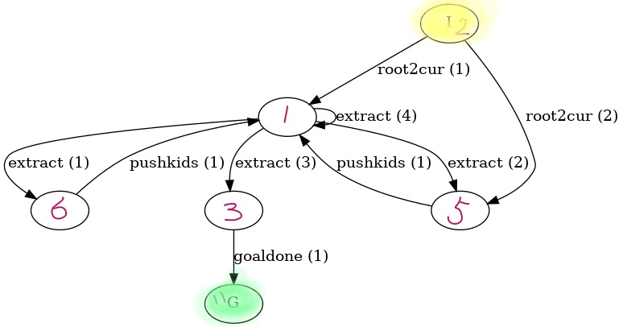
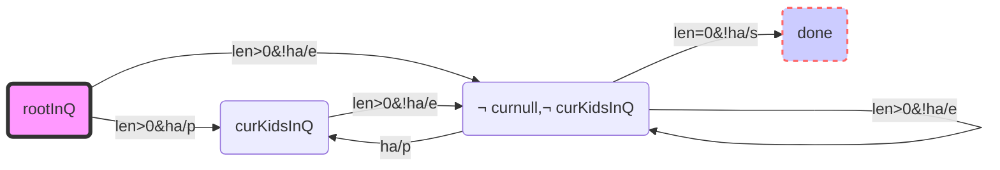

[toc]

---

```bash
./RunPRPForCurDomain.sh llvisitall
./PrintHuman_Policy.sh llvisitall
python ./DrawDotPolicy.py -domainname llvisitall

./RunPRPForCurDomain.sh reversell
./PrintHuman_Policy.sh reversell
python ./DrawDotPolicy.py -domainname reversell

./RunPRPForCurDomain.sh blocks_clear
./PrintHuman_Policy.sh blocks_clear
python ./DrawDotPolicy.py -domainname blocks_clear

./RunPRPForCurDomain.sh stripedtower
./PrintHuman_Policy.sh stripedtower
python ./DrawDotPolicy.py -domainname stripedtower

./RunPRPForCurDomain.sh RGBBlocks
./PrintHuman_Policy.sh RGBBlocks
python ./DrawDotPolicy.py -domainname RGBBlocks

./RunPRPForCurDomain.sh treetraversal
./PrintHuman_Policy.sh treetraversal
python ./DrawDotPolicy.py -domainname treetraversal

./RunPRPForCurDomain.sh 3colorblocks
./PrintHuman_Policy.sh 3colorblocks
python ./DrawDotPolicy.py -domainname 3colorblocks

./RunPRPForCurDomain.sh striped
./PrintHuman_Policy.sh striped
python ./DrawDotPolicy.py -domainname striped

./RunPRPForCurDomain.sh 3delivery
./PrintHuman_Policy.sh 3delivery
python ./DrawDotPolicy.py -domainname 3delivery


```

RunPRPForCurDomain.sh

```bash
#!/bin/bash
DOMAIN_NAME=${1} 
./prp/prp ./autogenerated/fond_${DOMAIN_NAME}_d.pddl ./autogenerated/fond_${DOMAIN_NAME}_p.pddl  --dump-policy 2 --optimize-final-policy 1
```

PrintHuman_Policy.sh

```bash
#!/bin/bash
DOMAIN_NAME=${1} 
python2 ./prp-scripts/translate_policy.py > ./solutionsByPRP/fond_${DOMAIN_NAME}_human_policy.out
```

Draw Graph for Policy generated by PRP Solver:

```bash
python ./DrawDotPolicy.py -domainname llvisitall
python ./DrawDotPolicy.py -domainname reversell
python ./DrawDotPolicy.py -domainname blocks_clear
python ./DrawDotPolicy.py -domainname treetraversal
python ./DrawDotPolicy.py -domainname blocks_clear
python ./DrawDotPolicy.py -domainname stripedtower
python ./DrawDotPolicy.py -domainname 3delivery

python ./DrawDotPolicy.py -domainname striped
```

---

```
./RunPRPForCurDomain.sh choppingtree2
./PrintHuman_Policy.sh choppingtree2
python ./DrawDotPolicy.py -domainname choppingtree2


```

Using PRP, you can directly solve the GENERATed GENERATED abstract file under the autogenerated folder, and the specific command is:

```cmd
./prp/prp ./autogenerated/fond_reversell_d.pddl ./autogenerated/fond_reversell_p.pddl  --dump-policy 2 --optimize-final-policy 1  

python2 ./prp-scripts/translate_policy.py > fond_reversell_human_policy.out
```

# Usage

autogenerated

```cmd
./prp/prp ./autogenerated/fond_reversell_d.pddl ./autogenerated/fond_reversell_p.pddl  --dump-policy 2 --optimize-final-policy 1  

python2 ./prp-scripts/translate_policy.py > ./solutionsByPRP/fond_reversell_human_policy.out


```

The resulting Policy looks like this:

```bash
Policy:

If holds: h_goal()
Execute: goal / SC / d=0

If holds: vstart()
Execute: 4_virtual_source_act_1_3  / SC / d=1

If holds: not(vstart())/not(h_curvisted())/not(h_goal())
Execute: 0_visitcur_3_1  / SC / d=1

If holds: not(vstart())/h_curvisted()/not(h_goal())
Execute: 1_updatecur2next_0_1  / SC / d=2
```

also, take

```cmd
./prp/prp ./autogenerated/fond_treetraversal_d.pddl ./autogenerated/fond_treetraversal_p.pddl  --dump-policy 2 --optimize-final-policy 1  

python2 ./prp-scripts/translate_policy.py > ./solutionsByPRP/fond_treetraversal_human_policy.out

```

robust

```
 ./prp/prp ./domain/tree/treetraversal_d.pddl ./domain/tree/treetraversal_p.pddl  --dump-policy 1 --online-deadends 1
```

4 steps

```
./prp/prp ./domain/blocksworld/domain-fixed.pddl ./domain/blocksworld/p1.pddl  --dump-policy 2 --optimize-final-policy 1  

python2 ./prp-scripts/translate_policy.py > human_policy.out
python2 ./prp-scripts/validator.py ./domain/blocksworld/domain-fixed.pddl ./domain/blocksworld/p1.pddl human_policy.out prp

dot -Tpng graph.dot > graph.png

```

The complete FOUR-step solution of THE FUND gets the policy and draws the process

```
./prp/prp ./domain/blocksworld/domain-fixed.pddl ./domain/blocksworld/p1.pddl  --dump-policy 2 --optimize-final-policy 1

python2 ./prp-scripts/translate_policy.py > human_policy.out

python2 ./prp-scripts/validator.py ../qnp2fond_blocks_d.pddl ../qnp2fond_blocks_p.pddl  human_policy.out prp

dot -Tpng graph.dot > graph.png
```

```
./prp/prp ./domain/tree/treetraversal_d.pddl ./domain/tree/treetraversal_p.pddl  --dump-policy 1 --online-deadends 1

./prp/prp ./domain/tree/tree_d.pddl ./domain/tree/tree_p.pddl  --dump-policy 1 --online-deadends 1
```

# The PRP input outputs a promisem example solution

## treetraversal give examples of FOND's domain file

  Fond high-order notation, predicate:

```
  	(:predicates ;derive predicate with 'cnf' & \# x.cnf(x)
  		(curisinternal)     ; cur != nullptr
  		(lenis0)			;(clearq) 
  		(curhasunvisitedkids)
  		(goal)	)
```

  Can be solved automatically using the FUND Solver SOA 'PRP' (corresponding to the algorithm Regex automata at the same time):

- roo2cur2q

  pre: $\neg curIsInternal \land lenIs0 \land \neg has\land \neg goal$
  successor: $ 1. curInter \land \neg lenis0\\2.curInter \land \neg lenis0 \land has $
- extractQFrontPopVisit && assign(cur,QFront)

  pre: $\neg lenIs0 \land \neg has$
  successor: $1.lenIs0 \land has\\ 2.\neg lenIs0 \land has\\3.lenIs0 \land \neg has\ \\ 4.\neg lenIs0 \land has (itself) \\$
- pushKidsIntoQueue

  pre: $curIsInternal \land has$
  successor: $\neg lenIs0 \land \neg has$
- goalDone

  pre: $curIsInternal \land lenIs0 \land \neg has \land \neg goal$
  successor: $goal$

  actions:

```lisp
	(:action root2Cur ; 'cur = root' and push(cur) into queue, problem assume at least one node
		:parameters ()
		:precondition (and 
			(not(curisinternal))
			(lenis0)
			(not(curhasunvisitedkids))
			(not(goal)))
		:effect (oneof  
			(and (curisinternal) (not(lenis0))                                      )
			(and (curisinternal) (not(lenis0)) (curhasunvisitedkids)  ))	)

	(:action extract ; 'cur=q.top & q.pop' in c++,'q.poll' injava
		:parameters ()
		:precondition (and (not(lenis0)) (not(curhasunvisitedkids)) )
		:effect (oneof
		(and (lenis0)      (curhasunvisitedkids)  )
		(and (not(lenis0)) (curhasunvisitedkids)  )
		(and (lenis0)      (not(curhasunvisitedkids)) )
		(and );'(not(lenis0)) (not(curhasunvisitedkids))' itself
		)	)

	(:action pushkids
		:parameters ()
		:precondition (and (curisinternal) (curhasunvisitedkids)  )
		:effect (and (not(lenis0)) (not(curhasunvisitedkids))     ))

	(:action goaldone
		:parameters ()
		:precondition (and 
			(curisinternal)
			(lenis0)
			(not(curhasunvisitedkids))
			(not(goal)))
		:effect (and
			(goal))	)
```

## problem file of treetraversal

```lisp
  (:init
	(not(curisinternal))
	(lenis0)
	(not(curhasunvisitedkids))
	(not(goal)))
  (:goal
	( and 
	(goal)
	)
  )
```

## Four steps to solving using PRP

Four steps to solving using PRP:

```bash
  python utils.py # clear history files
  # The first step is to call PRP to solve the ABOVEFOND advanced abstraction problem to get the 'policy.out' digital label of the policy intermediate representation format file
  ./prp/prp ./domain/treetraversal/treetraversal_d.pddl ./domain/treetraversal/treetraversal_p.pddl --dump-policy 2 --optimize-final-policy 1                  
  # Step 2: Turn 'policy.out' into an easy-to-understand format 'human_policy.out'
  python2 ./prp-scripts/translate_policy.py > human_policy.out
  # Step 3 Enter the domain file, problem file, policy file simulation run through to determine whether there is a strong cyclic solution / or the existence of Deadend.
  python2 ./prp-scripts/validator.py ./domain/treetraversal/treetraversal_d.pddl ./domain/treetraversal/treetraversal_p.pddl  human_policy.out prp
  # Step 4 The 'graph.dot' that generates the solution subgraph can be drawn by running through the simulation before the simulation can be drawn as 'graph .png'
  dot -Tpng graph.dot > graph.png
```

## treetraversal：

  Finally get the solution diagram drawn by Politice of the FONT problem:

  

- The above figure corresponds to the following in the Bonet text:



## Explain the first step of the PRP solution

Call PRP to solve the ABOVEFOND advanced abstraction problem to get the 'policy.out' number label in the middle of the policy representation format file

```bash
./prp/prp ./domain/treetraversal/treetraversal_d.pddl ./domain/treetraversal/treetraversal_p.pddl --dump-policy 2 --optimize-final-policy 1  
```

This step is three steps:

1. Running translator

Call the existing 'translate' work **$PDDLtext{-}totext{-}SAS+$**, from the extension 'oneof' action non-determining the subsequent state of the problem domain.pddl+problem.pddl two files, generate SAS+ format file (a combination of domain and problem is more suitable for directly reading the format of the search graph, thereby facilitating the search of the following graph)

2. Running preprocessor Generate the output.sas intermediate file

Preprocess the search source of the problem, including:

> Remove unnecessary effects from operators and axioms, then remove operators and axioms without effects.
>
> Building domain transition graphs...
>
> Calculate the problem size and Writing output...

3. Running search

   The graph search yields the final policy decision

Calling the classic solver fast-download gets the policy stored in the 'output' file.

For example, treetraversal will eventually generate such a convenient search policy:

```
Policy:

If holds: goal()
Execute: goal / SC / d=0

If holds: curisinternal()/not(curhasunvisitedkids())/kidsinq()/lenis0()/not(goal())
Execute: goaldone  / SC / d=1

If holds: curisinternal()/not(curhasunvisitedkids())/kidsinq()/not(lenis0())/not(goal())
Execute: extract  / SC / d=2

If holds: not(curisinternal())/not(curhasunvisitedkids())/kidsinq()/lenis0()/not(goal())
Execute: root2cur  / SC / d=3

If holds: curisinternal()/curhasunvisitedkids()/not(kidsinq())/not(goal())
Execute: pushkids  / SC / d=3
```

---

In front is the solver of the PRP core, solving a non-deterministic domain + a Promisem, the following is some of the follow-up work and capabilities of the PRP he mined (relatively weak, not the core solution part)

# prp batch processing promisems

The front is the prp solving action is not determined the subsequent state of the domain of the **a** problem search problem, for a domain multiple examples of duplex to stitch together the whole ** mutex ** OFD complete solution corresponding to the independent solution of the **subgraph**, the author wrote some very deliberately chiseled scripts, such as modifying the positive example to meet the complete problem to solve the problem OFD domain of the prospers.

```
python policy_experiment.py prp -domain blocksworld
```
